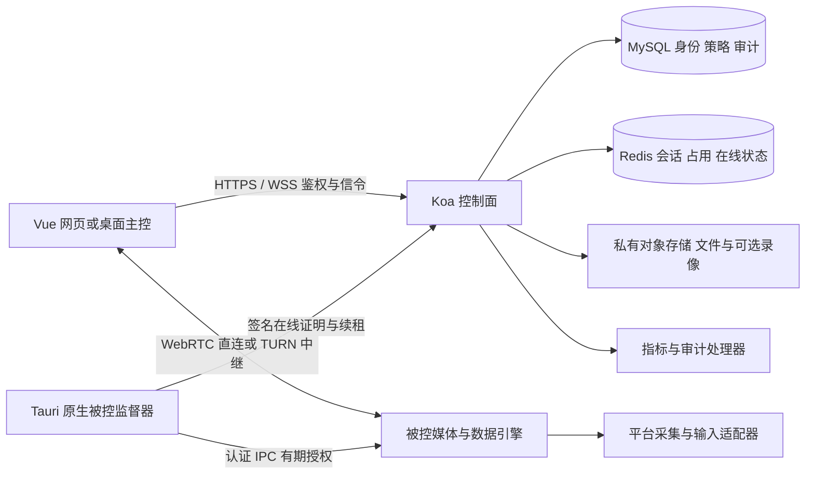

# 代码层详细实施方案

适用基线和功能编号见 [总表](./README.md)。本文所有“新增”、接口例子、表结构及配置名均为**设计提案，尚未实现**。现有路径用于指定修改位置，不代表其中已有提案能力。每个 W 工作包对应总表的一组 F 功能；平台依赖必须分别验收。

## 1. 架构和边界



媒体、文件直传和输入不经过 Koa JSON 消息转发；Koa 处理鉴权、会话、信令和策略。输入授权最终由原生监督器执行，即使前端绕过按钮也不能越权。TURN 只转发加密流量，不作为设备授权来源。后续引入 SFU 时会改变媒体信任边界，须重新定义加密与可见性，不沿用 P2P 的安全表述。

保留当前远控协议 v1：`pending → connecting → active → ended`，以 `requestId` 幂等、`expectedRevision` 并发校验、`connectionGeneration` 防旧连接、`controlEpoch` 隔离输入。当前只接受 `view/control` 两类 scope。文件、剪贴板、多参与者等不能直接塞入 v1 后宣称兼容，应协商 v2 或独立版本化扩展；服务端同时支持时按双方能力求交集，旧客户端保持 v1。

## 2. 工作包 W01：远控闭环和验收（P0）

**修改位置**：`backend-koa/src/services/remoteControlProtocol.ts`、`remoteControlService.ts`、`remoteControlRuntime.ts`、`remoteAuthorizationCoordinator.ts`；前端 `remoteControlPeer.ts`、`remoteControlSafety.ts`、`remoteControlInput.ts`；原生 `remote_control/host_runtime.rs`、`guard.rs`、`media_liveness.rs`、`input.rs`；引擎和采屏脚本；`docs/remote-control-cross-computer-acceptance.md`。

1. 固定当前授权、短租约、心跳、媒体失活和输入过期行为，补齐首次失败原因与会话关联 ID，不删除 watchdog 以换取“连接稳定”。区分输入暂停、网络重协商、整场结束，避免把可恢复输入延迟升级为无条件断屏。
2. 单调时间负责原生本地到期；服务器时间负责签名窗口。时钟调整不延长已授予本地租约。每次输入验证会话/epoch/序列/布局版本/期限；只读、暂停、失焦和失联释放所有按下状态。
3. 真实媒体到达且双方 ready 后才进入 active。权限撤销、引擎退出、画面布局变化按现有规则停止或暂停，不凭 Socket 在线认定画面可用。
4. 增加版本化能力结果：采集、输入、剪贴板、文件、窗口、音频分别报告 supported/permissionMissing/unavailable；保留“不支持”和“尚未验收”的区别。
5. 按平台与版本管理发布证据。现有 `REMOTE_CONTROL_PREVIEW_USER_IDS` 继续用于 S0；未来细粒度发布规则需后端持久化与客户端同步，不仅新增一个前端开关。

**测试**：延迟/乱序/重复输入、键盘按下后断网、旧 epoch 恢复、过期签名、设备撤销、权限中途取消、进程被杀、后台标签节流、30 分钟两机真实输入、1 小时到期。记录停止到最后一帧/最后一次输入及子进程退出的时间。

**交付拆分**：诊断和回归 → 异常状态收口 → 真机证据 → 按平台小范围开放。单元测试和同机测试不能替代最后两步。

## 3. W02：平台适配层与 Windows 被控

**现有入口**：`client-vue/src-tauri/src/remote_control/platform.rs`、`native_host.rs`、`input.rs`、`engine_bundle.rs`、`host_process.rs`、`scripts/package-remote-control-engine.py`。新增建议目录 `remote_control/platforms/{macos,windows,linux}/`，避免将所有条件编译堆到一个文件。

建议抽象（概念接口，具体类型以 Rust 生命周期及线程模型实现）：

```rust
trait HostPlatform {
    fn capabilities(&self) -> PlatformCapabilities;
    fn list_sources(&self) -> Result<Vec<CaptureSource>, HostError>;
    fn start_capture(&mut self, grant: VerifiedCaptureGrant) -> Result<(), HostError>;
    fn inject(&mut self, grant: VerifiedInputGrant, event: InputEvent) -> Result<(), HostError>;
    fn release_pressed_inputs(&mut self);
    fn stop_capture(&mut self);
}
```

`Verified*Grant` 只能由原生授权模块构造，不接收 WebView 声称已授权的布尔值。采集、编码和输入的错误转换为有限枚举；监督器不依赖 UI 存活才停止。

- macOS：保留 ScreenCaptureKit/现有输入路径，核对支持系统版本与实际所用 API 的最低版本；已有安装包的 macOS 12 声明不能替代 API 可用性检查。ARM 和 Intel 的引擎资源分别构建、签名和验收。[Apple 文档](https://developer.apple.com/documentation/screencapturekit)
- Windows：先做用户会话内捕获，评估 Windows Graphics Capture/Desktop Duplication；编码与 GStreamer 现有管线适配，输入通过 SendInput。UIPI 只允许向同等或较低完整性进程注入，不能把普通桌面输入成功视为 UAC/登录屏可控。安全桌面、用户切换和服务模式留给 W10。[Microsoft SendInput 文档](https://learn.microsoft.com/en-us/windows/win32/api/winuser/nf-winuser-sendinput)
- 平台最低版本建议：Windows 10/11 x64 先做实验矩阵，正式选择仍应按所用 API 和项目支持策略确认；Linux/移动端见 W12。Windows XP 不纳入本项目路线。

**验收**：普通/高 DPI/双屏、锁屏、UAC、睡眠恢复、显示器拔出、拒权、卸载；不支持情形必须返回明确状态且无持续输入。Windows 版包内引擎不能从用户 PATH 随意加载外部 DLL/可执行文件。

## 4. W03：画面、坐标、键盘和质量管理

**修改**：`remoteControlGeometry.ts`、`remoteControlInput.ts`、`remoteTextCommit.ts`、`remoteControlPeer.ts`、`views/remoteControl/index.vue`；原生 `media_layout.rs`、`host_transport.rs`；`scripts/remote-control-screen-source.swift`、`scripts/remote-control-host-engine.py`。新增 `remoteQualityPolicy.ts`、`remoteSessionStats.ts` 和平台 source selector。

实施顺序：

1. **基础坐标**：captureSourceId、layoutRevision、物理像素尺寸、缩放比例、旋转、内容矩形统一描述。输入绑定 layoutRevision；换屏先停输入、release-all、发布新布局，确认后重建控制授权。主控屏幕的 CSS 坐标不能直接当被控像素。
2. **显示与源切换**：先单屏切换，再多视频 track/多窗口展示；每屏有 trackId/layoutId。热拔插不自动切到另一块可能敏感的屏幕。改被控分辨率、壁纸等系统配置使用可恢复的本地事务记录。
3. **性能预设**：提案档位为兼容 720p/15fps/1Mbps、办公 1080p/30fps/4Mbps、清晰 1080p/60fps/8Mbps（最后一档先实验）；数字为可调整上限而非质量保证。协商实际编码器与支持帧率，原生编码器、WebRTC 和 UI 展示一致。
4. **自适应**：收集 RTCPeerConnection.getStats 与引擎编码耗时，检测丢包、RTT、发送队列；先降帧/码率，再降分辨率；恢复带滞回，避免震荡。对视频、文件、音频分配统一链路预算，限额变化可在会话内生效。
5. **输入**：组合键以物理键码和平台映射为基础；文本输入作为独立 text-commit，不在 IME composition 期间重复发送 keypress。鼠标只合并尚未发出的 move，不合并 down/up、滚轮方向或跨布局事件。浏览器保留组合键提示用户使用工具栏，系统安全键不伪造支持。
6. **窗口共享与应用控制**：采集只包含选择窗口；窗口消失即停止该源。应用控制还要核对目标应用/焦点/命中位置，并拦截会打开其它应用的操作；无法可靠保证时仅交付窗口观看，不承诺应用隔离控制。

**测试**：100/125/150/200% 缩放、屏幕负坐标、90/270 度旋转、视频黑边、窗口缩放、触控板滚动、中文组合输入/emoji/粘贴、带宽突变。性能回归使用固定场景和端到端测量，而非只看编码帧率。

## 5. W04：设备、会话入口与通知

**修改**：`models/RemoteControl.ts`、`router/remoteControl.ts`、`client-vue/src/api/remoteControl.ts`、`views/remoteControl/index.vue`、`remoteTabState.ts`、现有通知服务。新增设备目录页面、会话标签管理器及通知持久化模块。

- 设备列表增加编辑别名、分页/搜索、分组、最后在线和有限硬件字段；在线以原生签名证明为依据，不以数据库注册成功为依据。
- 原生设备身份指纹保持不可变；名字/分组是元数据。删除设备沿用撤销，关联许可和活动会话一并失效，不能简单删行后重建绕过撤销。
- 多标签先在单进程管理多会话；每个标签有 sessionId、独立 peer、输入状态和资源清理器。路由切换不丢原生被控提示，后台标签不得继续捕获键盘。
- 邀请 URL 含高熵一次性 token，服务端只存摘要；兑换后建立有界协助许可。发送链接仅增加发现/申请能力，仍须本地同意或已显式配置的信任策略。短码限制重试与枚举，不在 URL 放设备密钥或登录 JWT。
- 通知用 eventId 去重，按有权设备用户推送；线上抖动合并，断线宽限后再下线。微信订阅需额外账号/模板配置，仅作为后续适配器。

**新增接口提案**：`PATCH /api/remote-control/devices/:id`、`GET/PUT .../devices/:id/preferences`、`POST .../invitations`、`POST .../invitations/redeem`、`GET /api/notifications?cursor=...`、`POST /api/notifications/:id/read`。每个对象均在服务端重验所有者/组织授权；用游标分页，禁止客户端指定 ownerUserId 覆盖归属。

**验收**：同名设备、别名特殊字符、并发编辑、跨租户 ID、撤销后在线抖动、多标签关闭和重新登录；通知无重复且不泄露设备存在性。

## 6. W05：文件传输与剪贴板

**复用**：`fileController.ts`、`qiniuStorageService.ts`、`models/File.ts`；新增 `services/remoteFileTransferService.ts`、`remoteClipboardPolicy.ts`，前端 `remoteFileTransfer.ts`、`remoteClipboard.ts`，原生 `remote_control/file_transfer.rs`、`clipboard.rs`。原有聊天云文件保持现有语义，设备直传使用新的 transferId。

### 6.1 文件协议

新增受能力协商的可靠 DataChannel `rc-file-v1`，不复用有时效的输入通道。任务状态：offered → accepted → transferring → verifying → completed，允许 paused/cancelled/failed。服务端存任务元数据和审核记录，文件内容优先端到端传输。

提案消息（不可直接加入 v1 输入 JSON）：

```ts
type TransferOffer = {
  version: 1;
  transferId: string;
  sessionId: string;
  authorizationRevision: number;
  direction: 'controller-to-host' | 'host-to-controller';
  file: { name: string; size: string; sha256: string };
};
type ChunkHeader = {
  transferId: string;
  offset: string;
  length: number;
  sha256: string;
};
```

大小/偏移使用十进制字符串以避免 JS 超大整数精度问题。每块建议从 64KiB 起，实际不超过双方协商的 DataChannel 消息上限，必要时再分帧；二进制载荷不使用 Base64。使用 bufferedAmount 高低水位回压，磁盘写入亦有队列上限；文件通道拥塞不阻塞输入状态通道。

接收方选目录，原生以受限目录句柄创建临时文件；拒绝绝对路径、`..`、符号链接/重解析点逃逸、保留设备名和超额文件。写完逐块/全量哈希校验后原子改名。同名处理由用户选跳过/改名/覆盖，覆盖必须显式选择。取消关闭句柄并按策略删除临时文件；空间不足报告可恢复错误。

断点记录文件标识、已确认范围及哈希。续传重验权限和源文件是否变化，不接受过期会话继续写入。多目录传输先传规范化 manifest，限制深度/数量/总大小。浏览器下载能力不足时使用用户选文件或明确云端暂存路径，不能声称与桌面文件管理器等价。

云端备用路径使用七牛私有空间、短期上传下载凭证、对象生命周期和范围校验；UI 显示“经云端暂存”。批量分发生成父任务及每设备子任务，设备取到文件后不自动运行。配额、分片断点和清理任务纳入 W16。

### 6.2 剪贴板

独立 scope：clipboard.read / clipboard.write；授权方向清晰。优先纯文本，单次建议 1MiB 上限；图片在后续版本独立启用。格式白名单、序列号、来源 ID、内容摘要去重，防止双向回环。浏览器剪贴板可能要求用户手势，提供显式复制/粘贴按钮，不用隐藏轮询规避权限。

会话结束停止监听并清空程序缓存，不默认清空用户系统剪贴板。不要在日志、数据库或诊断包记录剪贴板正文。已有 `remoteTextCommit.ts` 只代表文本注入，不代表剪贴板同步。

**验收**：0 字节、>4GiB、中文/长路径、断网续传、文件改变、磁盘满、路径穿越、符号链接替换、撤权、双方同时复制、多标签隔离、媒体与大文件并发。

## 7. W06：沟通、标注、多人和录制

**复用**：`config/meeting.ts`、`services/mediaRoomRegistry.ts`、`screenAnnotationService.ts`、`ScreenAnnotation.vue`、`MediaRecorder.vue`、现有聊天与通话。新增 `remoteCollaborationService.ts` 与远控参与者状态模型。

首先补全现有 `join_group` / `join_group_call` 的成员资格检查，并逐项核对 offer/answer/ICE、标注和通知转发的参与者权限；当前代码这两个加入入口不能作为组织隔离基础。成员被移除后清理房间和订阅，不能等待客户端主动退出。

多人协议需从单 controller/host 扩展为 room+participants。先交付 1 被控+最多 3 观看者的实验限制，并且仅 1 个 controlOwner；转移控制权采用 CAS 和递增 controlEpoch，先 release-all 再授予新持有人。本地被控始终能抢回/结束。真正多人同时 OS 输入另立实验，不把多指针 UI 当已支持多人同控。

小规模先受限 P2P，复制上行随观看者数量增长；实测上行不足再选择 SFU。SFU PoC 需确定独立产品/依赖、运维端口、媒体可见性及密钥方案，不能直接套用本项目 P2P 授权。屏幕墙以每设备低帧率流和独立观看票据组成，限制同时解码数量并提供分页。

标注动作绑定 sessionId、sourceId、layoutRevision、actorId、actionId；绘制权限与控制权分离，快照/草稿/撤销延用既有思路。换屏换布局时不能把旧坐标笔画覆盖到新内容。

录制先本地：明确录制者、被录内容和参与者提示；调用 MediaRecorder 前探测 MIME，停止等待最终 dataavailable 后落盘。长录像流式/分段保存，磁盘不足和应用崩溃留下可恢复段；音视频同步另测。云端归档为可选后续能力，有保留期和下载权限，不自动上传本地录像。

## 8. W07：授权策略、MFA 与凭证

**修改/新增**：`remoteControlPolicy.ts`、`remoteAuthorizationCoordinator.ts`、`remoteLiveAuthority.ts`、`remoteCredentials.ts`、`loginSessionService.ts`；新增 `remoteAccessPolicyService.ts`、`mfaService.ts`；原生 `authorization.rs`、`consent_memory.rs`、`device_store.rs`。

统一策略输入：actor、hostDevice、组织、关系、请求 scope、MFA freshness、本机策略、deviceKeyVersion。决策规则：显式拒绝优先；组织、用户、本机策略求交集；scope 和期限仅能缩小；服务端许可不替代系统权限。策略在创建、接受、续租、敏感操作时校验，缓存带 policyVersion 并有可接受的失效上限。

扩展 scope 提案：view、control、clipboard.read/write、files.read/write、audio、camera、record、power、terminal、peripheral。分组展示给用户；新增 scope 不能默认继承老的 control。签名证明绑定 scope 列表及策略版本，原生采用严格解析和目的隔离。

MFA 首版 TOTP+一次性恢复码；TOTP 秘密使用服务端独立加密密钥保护，恢复码只存摘要；验证有速率限制、防时间步重复、时间漂移范围及可靠恢复流程。绑定/重置 MFA 需要近期登录验证，不能仅凭已劫持的长期 token 完成。后续可信设备确认绑定请求 ID、登录设备、到期及展示内容，避免泛化“允许所有”。

同账号快捷连接必须用户明确启用并登记可信主控设备；每次仍有签名身份/短租约与可见提示。无人值守采用独立授权类型和可撤销凭证，绝不直接让现有临时协助变成无限会话。若提供固定访问密码，使用专用密码 KDF、随机盐、尝试限额和设备端校验设计，凭证不复用系统密码，详细协议在 W10 PoC 后评审。

应用锁定应由原生/服务端同时禁止敏感命令；仅隐藏页面不能阻止已有 Socket 发起操作。二次验证、客户端锁定、系统锁屏三者分开存储和测试。

**验收**：允许/拒绝冲突、跨组织设备、旧策略续租、MFA 重放/恢复码重用/暴力猜测、被盗 cookie、删除可信设备、同账号恶意客户端、权限降级后的文件与输入停止。

## 9. W08：网络接入、节点目录与 TURN

**修改**：`services/remoteIce.ts`、`remoteControlIce.ts`、原生 `ice.rs`、`host_transport.rs`，部署脚本 `deploy/configure-remote-control.py`。配置和可操作步骤见 [服务器方案](./SERVER.md)。

S0 先将独立 REST TURN 验证为可用路径，保留既有 static 配置作为明确的旧路径，不自动静默降级。凭据到期不等于已建立 allocation 立即断开；原生租约才是会话停止边界。分别测 UDP/TCP，TLS 仅在证书、监听、客户端解析实测通过后加入。

S3 新增节点目录：region、URLs、health、capacity、drain、credentialIssuer。测量延迟和负载后选节点，签发的凭据仅适用于获选节点。当前环境变量模式是全局共享 secret，后续需节点级凭据服务/配置，不能给所有地域硬编码同一密钥。

保留 P2P 优先；企业可指定 relay-only。会话故障迁移应明确为重新协商/重建，遵循连接代次和原生新授权，不承诺无缝迁移已有 TURN allocation。记录网络类型而不把完整 SDP/内网候选写入日志。

## 10. W09：组织、设备权限与配额

新增 `Organization`、`OrganizationMember`、`DeviceGroup`、`DeviceAssignment`、`OrganizationRole`、`RemoteQuota` 模型及 `organizationPolicyService.ts`。个人设备仍归 ownerUserId，组织接管需显式确认，不能仅修改前端分组。

角色建议：owner、admin、operator、viewer、auditor。控制、文件、终端、策略编辑、审计下载分别授权；管理员身份不自动赋予查看所有桌面的权限。成员离职同时撤销组织权限、信任关系和活动会话。

并发配额在服务端原子分配，维度包括组织/用户/被控设备/中继带宽；退出幂等释放，异常由扫描器回收。屏幕墙每个设备单独消耗观看配额；批量分发限制并发和总字节。

新增接口建议 `/api/organizations/:orgId/{members,device-groups,assignments,policies,quotas,audit-events}`。所有查询都绑定组织和对象归属，分页导出也走同一授权。现有聊天 `Group` 不兼作组织表。

## 11. W10：原生服务与系统运维

新增平台 service/helper 子工程，通过认证 IPC 接受**受限动作**，不开放“任意命令字符串”的通用高权限执行口。UI 用低权限用户进程；后台服务负责设备在线、登录会话定位、必要的系统动作；采集/输入优先放在用户会话进程，避免高权限服务直接处理所有外部输入。

第一批动作：keepAwake、lock、launchApprovedApp；第二批 reboot/shutdown/wake；第三批 terminal。每个动作带 actionId、设备、scope、期限、签名、是否需要本地确认，审计开始/结果。启动应用使用登记的应用 ID 与参数白名单，不拼接 shell 命令。

Windows 服务与用户桌面隔离、UAC、安全桌面、快速用户切换分别研究；macOS 使用明确安装授权的 helper/agent，不能绕过 TCC。系统锁屏密码由系统组件处理，不交给网页、云端日志或普通配置文件。自动解锁未完成原型前不给入口。

无人值守需要设备端显式启用、强验证、独立可撤销许可、本地可关闭、升级后保持可用且权限不扩大。开机前/登录前可控独立验收，不能由“应用启动时自动登录”推断。

终端使用受限角色的 PTY/ConPTY 会话；进程树、输出队列、最大时长、窗口大小、退出清理均有上限。审计可能含敏感内容，默认结构化动作记录；全文记录须明确策略和访问权限。

WOL 由同网段已授权在线代理发送 magic packet，记录网卡/BIOS/交换网络前提；公网服务不能凭设备 ID 唤醒已断电且无可达代理的电脑。

## 12. W11：发布、签名与自动更新

**修改**：`.github/workflows/desktop-release.yml`、`scripts/desktop-release.mjs`、`scripts/product-version.mjs`、Tauri 配置；后续引入 updater 插件，新增更新清单生成和发布渠道服务。

先完成 macOS 正式签名/公证、Windows 代码签名、引擎资源 hash 校验及许可证清单；现有临时签名导致的权限变化要单独复验。更新采用 stable/preview 的逻辑渠道，但当前实际包仍只发内测版本；稳定渠道启用须另定产品阶段。

更新清单按 OS/arch/channel 返回版本、URL、签名、最低协议版本、说明及灰度分桶；下载和安装前校验签名、目标及版本关系。升级前结束或延迟活动会话，备份必要配置，失败保留上一可启动版本。防回退只允许明确签名的恢复方案，不让任意旧包绕过安全修复。

[Tauri updater 官方文档](https://v2.tauri.app/plugin/updater/)要求更新签名验证；更新签名与操作系统应用签名是不同用途，密钥分别管理。新增插件需锁定依赖并验证当前 Tauri 兼容，不在规划阶段更改依赖。

## 13. W12：Linux、移动端和电视

- Linux：先选一个明确发行版/桌面组合。Wayland 通过 ScreenCast/RemoteDesktop portal 及相应会话授权；X11 单独实现与测试，不将两者视为同一路径。发行版缺少 portal 能力时如实关闭输入。[XDG RemoteDesktop 文档](https://flatpak.github.io/xdg-desktop-portal/docs/doc-org.freedesktop.portal.RemoteDesktop.html)
- Android：新增原生采集/编码/输入模块，MediaProjection 系统授权与输入服务授权分离，保持前台服务和可见通知。新 Android 版本对采集会话授权和 token 使用有约束，必须遵守，不能用缓存 token 永久采屏。[Android MediaProjection 文档](https://developer.android.com/media/grow/media-projection)
- iOS/iPadOS：先主控、手势和接收画面；屏幕广播作为可选单独能力，不承诺系统级被控输入。后台切换立即暂停远端输入。
- 鸿蒙：区分 Android 兼容系统和原生 HarmonyOS，原生版另做 SDK 原型及发布流程；不从 Android 包推断兼容。
- 电视：先浏览器/Android TV 只读接收器、短时配对及取消配对；Chromecast/AirPlay 等协议适配另立范围，不在第一版混做。

移动端共享账号、信令和权限语义，但平台代码独立。现有响应式网页及 Tauri 桌面包不等于原生手机产品。

## 14. W13：外设与打印专项

统一外围设备通道 envelope：deviceClass、deviceInstance、sequence、capability、authorizationEpoch、payloadLength；每种设备独立 schema、包长和速率限制，不提供无约束的 USB/IP 透传。驱动进程与 UI/媒体引擎隔离，热拔插或授权结束立即复位/卸载虚拟设备。

建议顺序：自定义按键与相对鼠标 → 手柄 → 数位板 → 摄像头/麦克风虚拟设备 → 3D 控制器 → USB 授权设备。每项先验证目标系统公开 API、厂商 SDK 和签名驱动要求，再选择自研或经许可依赖；输出硬件支持表、延迟数据、安装与卸载回滚方案。

打印分两层：文件导出到本地再打印作为早期替代能力；透明打印重定向需远端打印插件、本地 spooler、任务取消、字体/纸张/权限处理，单独验收。摄像头“查看”不等于另一端应用能选到“虚拟摄像头”。

## 15. W14：高性能、虚拟屏与隐私屏专项

为每组 profile 协商 resolution、fps、codec、chroma、bitDepth、colorSpace、HDR metadata 和 decoder 能力。先建立 1080p 基线，测试 4K/60，再考虑更高帧率；4:4:4 与 HDR 不能只改变前端菜单，需完整采集/编码/传输/解码/显示链路。浏览器与 WebView 不支持的档位返回降级原因。

虚拟显示先 Windows 支持的驱动模型 PoC；硬件加速、无头启动、休眠/恢复和卸载后桌面恢复均需真机。macOS 虚拟显示方案只在确认公开可用接口/可分发依赖后确定，不把私有 API 当产品默认路径。

隐私屏必须证明现场不可见且远端持续可用、结束恢复、崩溃后恢复，并与系统锁屏、禁用物理输入分离。保留本地紧急退出途径；安全权限不足时拒绝启用，不使用覆盖普通黑窗口来伪称系统级隐私保护。

## 16. W15：审计与 AI

先在现有 `remote_session_events` 外新增业务审计表/服务，不将原生命周期表改成存任意输入正文的日志。记录 actor、device、session、action、result、policyVersion、traceId、occurredAt；原始画面和键盘正文默认不采集。

规则层先识别异常登录、连接失败突增、策略变更、大量下载、终端启动等已有可验证事件。AI 可总结事件和经同意上传的抽样材料，报告必须链接证据、标识推断和缺失信息；模型误报不能自动处罚用户或静默扩大监控。

AI 助手先只读建议。若加入执行：工具白名单、参数 schema、执行前策略校验、用户确认、操作结果审计；外部文档/网页内容不能下达原生指令。模型密钥仅在后端；供应商、数据区域、费用/配额及保留期在接入前确定。当前模拟 SSE 页面不计入真实 AI 能力。

## 17. W16：观测、可靠性与多实例

**修改**：`config/meeting.ts` 内存映射、`remoteLiveAuthority.ts`、`remoteControlRuntime.ts`、`initializeRemoteControlRuntime.ts`、`redisRemoteSessionStore.ts`、`database/schemaMigrations.ts`；新增指标导出、诊断包和实例所有权模块。

单实例阶段先完善就绪/存活、首次停止原因、DB/Redis 依赖状态、审计落库失败与对账。远控严格依赖授权可用性，授权系统不可达不能无限续租。

多实例不能只加 Socket.IO Redis adapter。当前运行时启动会处理前一进程遗留会话，直接启动第二实例可能误终止第一实例会话。改造顺序：

1. Redis 全局在线目录维护 endpoint→instanceId/socketId，带 generation/TTL；本地映射只作缓存。
2. 新增 sessionOwner 的租约和 fencing token，原子 CAS 接管；处理器、续租和 outbox 提交拒绝旧 token。
3. 扫描器只处理本实例拥有会话或完成 fenced 接管的会话；重启不得清空全局活动集合。
4. Socket.IO 跨实例 adapter 与业务路由同时接入；HTTP polling 仍启用时配置粘性会话，仅 WebSocket 模式也要处理重连。[Socket.IO 多节点文档](https://socket.io/docs/v4/using-multiple-nodes/)
5. drain 模式停止接新会话，等待/有序结束现有会话，再部署；不承诺故障时会话无感续接。
6. 双实例杀进程、Redis 切换、网络分区、旧 owner 恢复、并发撤销和重复消息均跑集成测试，保证一个会话只有一个有效授权写入者。

Redis 故障/重启后不能依据恢复的旧快照让会话自动恢复控制；先终止/重新确认。MySQL 审计幂等键和 outbox 保证终态可对账，不依赖内存日志。

## 18. 数据模型与接口演进清单

以下为增量提案。生产禁止 `sync({alter:true})`。当前迁移执行器使用明确文件列表，新增 SQL 同时修改 `database/schemaMigrations.ts` 的 migrationFiles、结构检查及幂等执行支持；只放一个 `.sql` 文件不会自动生效。

| 表/字段提案 | 关键字段与索引 | 生命周期及说明 |
| --- | --- | --- |
| remote_devices 扩展 | agentVersion、capabilitiesVersion、lastSeenAt；ownerUserId+revokedAt 索引保留 | 在线事实仍由有效证明得出；原生硬件详情另表，支持删去详情 |
| remote_device_preferences | userId+deviceId 唯一、schemaVersion、settingsJson、revision | 只存体验偏好，JSON schema 校验，ETag/CAS 更新 |
| remote_device_groups / assignments | organizationId、groupId、deviceId，组合唯一与组织索引 | 与聊天群独立；归属变更写审计 |
| remote_access_policies | subjectType/id、device/group、scope、effect、version、expiresAt | deny 优先，权限变更递增版本并通知活动会话 |
| remote_invitations | tokenHash 唯一、deviceId、maxUses、usedCount、expiresAt、revokedAt | 原子消费；不存明文 token；过期清理保留受限审计 |
| remote_transfers / transfer_files | transferId、sessionId、sender/receiver、direction、state、size、hash、offsetRevision | 不存文件内容；索引参与者+createdAt，临时对象 TTL 单独管理 |
| notifications | eventId+userId 唯一、deviceId、type、readAt、createdAt | 按收件人分页；建议 90 天，可配置 |
| organizations / organization_members | organizationId+userId 唯一、role、status、revision | 删除成员保留审计，不删除关联设备历史 |
| remote_room_participants | roomId+endpointId 唯一、role、generation、joinedAt、leftAt | 多人模式专用；现有 v1 会话表保持兼容 |
| security_factors / recovery_codes | userId、encryptedSecret、keyId；codeHash+consumedAt | 加密密钥独立托管，重置撤销旧因子 |
| remote_audit_events | eventId 唯一、orgId、sessionId、actorId、action、result、traceId | 建议 180 天，组织可缩短；只读访问与导出审计 |
| remote_jobs / job_targets | jobId、kind、requestId 唯一、deviceId、state、deadline | 分发/更新/电源任务，过期不执行，重试幂等 |

通知 90 天、审计 180 天等是新功能初始建议，须按实际产品需求配置；不改变现有远控历史保留规则。模型建成前不将这些参数写入生产 .env。

协议提案示例：

```ts
type NegotiatedCapabilities = {
  protocolVersions: number[];
  features: Record<string, {
    version: number;
    supported: boolean;
    reason?: string;
  }>;
};
type ActionRequest = {
  requestId: string;
  sessionId: string;
  expectedRevision: number;
  authorizationRevision: number;
  scope: string;
  payload: unknown; // 服务端和原生按 scope 使用严格 schema 解析
};
```

所有新增写接口使用 requestId 幂等和对象权限验证，409 表示状态/修订冲突、403 表示权限、429 表示频率/配额、503 表示依赖/能力未就绪；客户端根据稳定 errorCode 给出可操作提示。不能用“请求发送成功”展示系统操作已完成。

## 19. 验证与合并约束

代码实现阶段的基础命令（本次文档任务未执行这些产品测试）：

```sh
pnpm version:check
pnpm test:release
pnpm typecheck
pnpm --filter backend-koa test
pnpm --filter client-vue test
cargo test --locked --manifest-path client-vue/src-tauri/Cargo.toml
pnpm --filter backend-koa test:remote:integration
pnpm --filter client-vue test:e2e
```

集成测试先读取对应配置，使用专用可销毁 DB/Redis，绝不指向生产。远控原生/引擎、TURN 探针、各平台环境测试另按现有专项文档运行；被忽略的平台测试不得写成已通过。新功能增加针对权限边界、异常清理和协议兼容的测试，不为每个 UI 文案增添无意义测试。

每个工作包建议拆成：数据/协议与兼容 → 后端策略/原生实现 → 前端入口和降级 → 自动验证 → 真机验收与开关。较大功能在该批中文提交中同步版本，参考 `docs/DESKTOP_RELEASE.md`。没有验收证据的能力可交付隐藏原型，但禁止发布为已支持。
